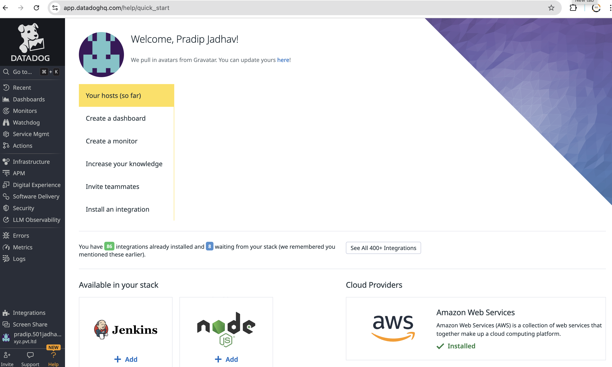
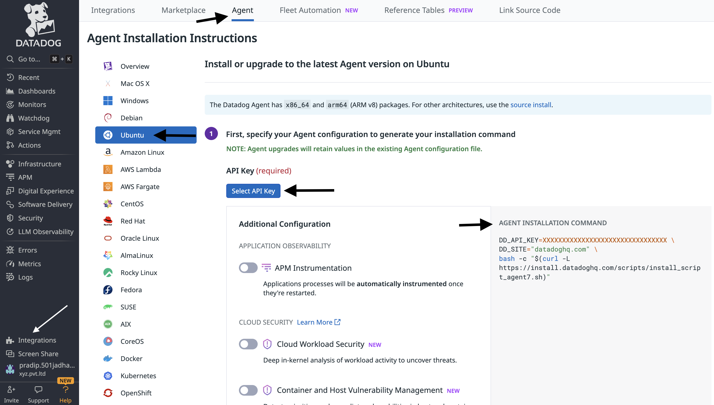
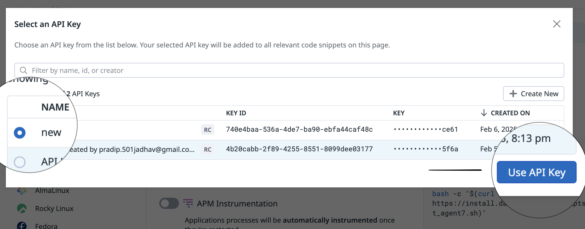
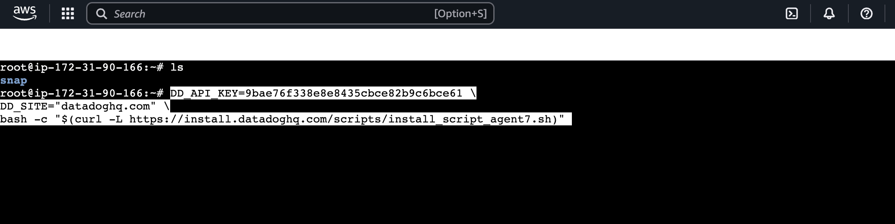
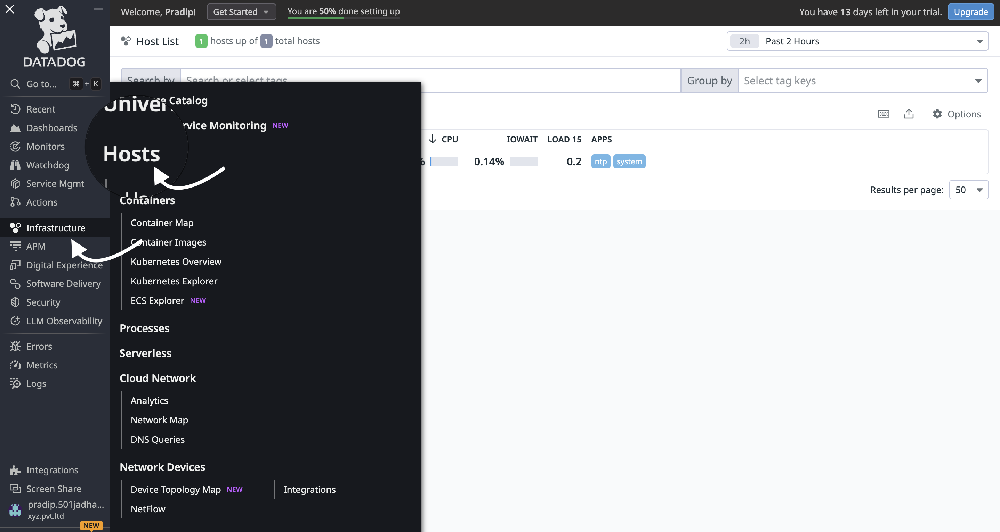
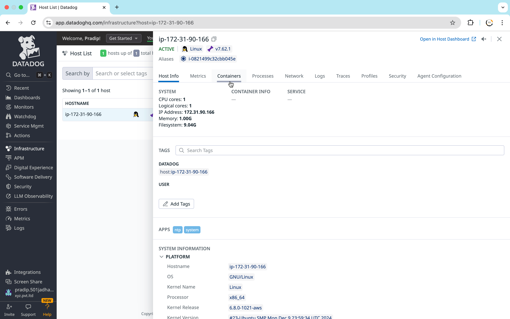
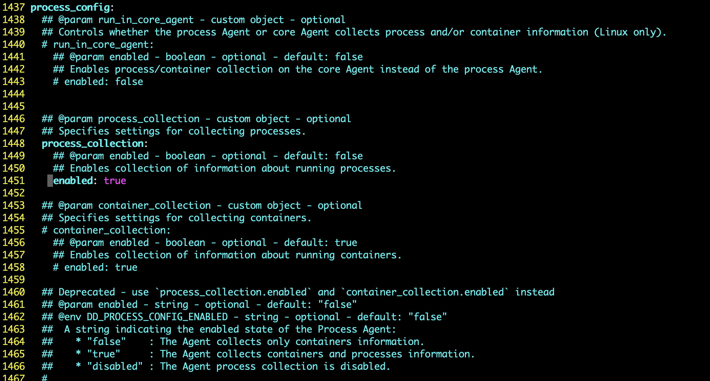

# Monitoring Tool: Datadog

## Introduction to Datadog
Datadog is a cloud-based monitoring and security platform for developers, IT teams, and security engineers. It provides real-time observability into applications, infrastructure, logs, and security insights.

### Key Features:
- Infrastructure Monitoring
- Log Management
- Application Performance Monitoring (APM)
- Security Monitoring
- Real-time Dashboards

---
# Datadog Dashboard Documentation



## Overview
This document provides details about the Datadog dashboard, including its purpose, key metrics, logs, and alerts.

## Dashboard Name: `Your Dashboard Name`
**Description:** Briefly explain the purpose of this dashboard (e.g., monitoring application performance, tracking infrastructure metrics, etc.).

## Dashboard URL
Provide the Datadog dashboard link if applicable: `[Datadog Dashboard Link](#)`

## Sections & Widgets

### 1. Recent Dashboard
- **Latest Updates**
  - Displays recent changes and updates to the dashboard.

### 2. Monitor & Watchdog
- **Active Alerts & Monitoring**
  - Overview of current alerts and automated anomaly detection.

### 3. Service Management
- **Service Health Metrics**
  - Tracks the status of various services.

### 4. Actions in Depth
- **Detailed Analysis of Alerts & Events**
  - Provides deep insights into triggered actions and responses.

### 5. Infrastructure
- **System Performance Overview**
  - Tracks system resource utilization.

### 6. In-depth Analysis
- **Granular Insights**
  - Provides deeper insights into system and service health.

### 7. APM (Application Performance Monitoring)
- **Application Metrics & Tracing**
  - Monitors performance of deployed applications.

### 8. Digital Experience
- **User Interaction & Performance**
  - Measures frontend and backend performance from a user perspective.

### 9. Software Delivery
- **Deployment & CI/CD Monitoring**
  - Tracks software deployment cycles and success rates.

### 10. Security
- **Threat Detection & Vulnerability Monitoring**
  - Analyzes potential security risks and compliance issues.

### 11. LLM Observability
- **AI Model Performance & Logs**
  - Observes large language models and their operational metrics.

### 12. Errors & Metrics
- **Error Rate & Key Metrics**
  - Tracks system-wide error rates and performance indicators.

### 13. Logs & Integration
- **Log Streams & External Integrations**
  - Displays logs and connects with external services for monitoring.

## Contact
For any issues or enhancements, contact `your-email@domain.com` or raise an issue in the repository.


## Installing the Datadog Agent on Linux 

# Installing Datadog Agent on Ubuntu

## Prerequisites
- Ubuntu 20.04 or later
- Sudo or root access
- Datadog API key (create one if you don't have it)


## Step 1: Go to Datadog Integrations
1. Log in to your [Datadog account](https://app.datadoghq.com/).
2. Navigate to **Integrations**.
3. Select **Agent**.
4. Choose **Ubuntu** as the integration platform.




## Step 2: Obtain API Key
- If you already have an API key, proceed to the next step.
- If not, create a new API key in your Datadog account.




## Step 3: Run Installation Command on Ubuntu Server
1. Copy the installation command provided by Datadog.
2. SSH into your Ubuntu server.
3. Paste and run the command in the terminal.



## Step 4: Start and Enable Datadog Agent
```sh
sudo systemctl start datadog-agent
sudo systemctl enable datadog-agent
```

## Step 5: Verify Integration on Datadog Dashboard
1. Go to the **Datadog Dashboard**.
2. Navigate to **Infrastructure**.
3. Select **Host** to view the integrated Ubuntu server.

## Setup Complete
Your Ubuntu server is now integrated with Datadog and ready for monitoring!




3. **Verify Installation**
   ```bash
   sudo systemctl status datadog-agent
   ```


### Installing Datadog Agent on Docker
1. **Run the Datadog Agent as a Docker container:**
   ```bash
   docker run -d --name datadog-agent \
     -e DD_API_KEY=<YOUR_API_KEY> \
     -e DD_SITE="datadoghq.com" \
     -v /var/run/docker.sock:/var/run/docker.sock:ro \
     -v /proc/:/host/proc/:ro \
     -v /sys/fs/cgroup/:/host/sys/fs/cgroup:ro \
     datadog/agent:latest
   ```

2. **Check Logs**
   ```bash
   docker logs datadog-agent
   ```

---

## Introduction to the Datadog UI
The Datadog UI provides dashboards and visualizations for real-time monitoring. Key sections include:
- **Infrastructure Overview** – Displays system-wide metrics.
- **APM & Tracing** – Monitors application performance.
- **Logs** – Aggregates and analyzes logs in real-time.
- **Security** – Identifies threats and vulnerabilities.

### Navigating the UI
1. **Log in to Datadog Dashboard**
2. **Explore Metrics and Logs**
3. **Create Custom Dashboards**

---

## Introduction to Infrastructure Monitoring
Infrastructure Monitoring in Datadog helps track system performance, health, and resource usage.

### Metrics Monitored:
- **CPU Usage**
- **Memory Consumption**
- **Disk Usage**
- **Network Traffic**

### Steps to Monitor Infrastructure:
1. Install Datadog Agent on all hosts.
2. Configure tags for easy identification.
3. View real-time metrics on the **Infrastructure Dashboard**.

---

## Monitoring Hosts
Hosts refer to physical or virtual machines running in your environment. Datadog provides deep monitoring insights into each host’s performance.

### Steps to Monitor a Host:
1. Navigate to **Infrastructure > Hosts**.
2. Filter hosts based on tags, regions, or instance types.
3. Monitor CPU, RAM, and Network usage in real-time.

---

## Monitoring Docker and Kubernetes
Datadog can be used to monitor containers running in Docker or Kubernetes clusters.

### Monitoring Docker Containers
1. **Enable Docker Integration:**
   ```bash
   sudo datadog-agent integration install datadog-docker
   ```
2. **Enable container monitoring in `datadog.yaml`:**
   ```yaml
   listeners:
     - name: docker
   ```
3. **Restart the Datadog Agent:**
   ```bash
   sudo systemctl restart datadog-agent
   ```

### Monitoring Kubernetes Clusters
1. Deploy the Datadog Agent as a DaemonSet in Kubernetes:
   ```bash
   kubectl apply -f https://raw.githubusercontent.com/DataDog/datadog-agent/master/Dockerfiles/manifests/kubernetes/daemonset.yaml
   ```
2. Verify the pods are running:
   ```bash
   kubectl get pods -n datadog
   ```

---
## Difference Between Prometheus and Grafana

| Feature         | Prometheus        | Grafana            |
|----------------|------------------|--------------------|
| Purpose       | Time-series database and monitoring tool | Visualization and analytics platform |
| Data Storage  | Stores time-series data natively | Does not store data; connects to data sources |
| Query Language | PromQL (Powerful metric queries) | Uses different query languages based on data source |
| Alerting      | Built-in alert manager | Supports alerting via integrated services |
| Integration   | Native support for Kubernetes, Docker | Connects with multiple sources including Prometheus, AWS, MySQL |
| Visualization | Limited | Rich graphical dashboards |
| Use Case      | Collects and processes metrics | Displays and visualizes collected data |

**Conclusion:**
- Use **Prometheus** for data collection and storage.
- Use **Grafana** for visualization and dashboarding.
- Both tools are often used together for complete monitoring solutions.

---

# Setting up Datadog Agent on Kubernetes

## 1. Installing the Datadog Agent on Kubernetes
Datadog provides a Kubernetes agent that allows you to collect metrics, logs, and traces from your cluster.

### Steps to Install:
1. **Create a Datadog API Key**: 
   - Go to Datadog dashboard → Integrations → APIs → Create an API key.
2. **Deploy the Agent using Helm**:
   ```sh
   helm repo add datadog https://helm.datadoghq.com
   helm repo update
   helm install datadog-agent --set datadog.apiKey=<YOUR_API_KEY> datadog/datadog
   ```
3. **Verify the Installation**:
   ```sh
   kubectl get pods -n default | grep datadog
   ```
   Ensure the pods are running successfully.

---
## 2. Host Maps and Container Maps
Datadog provides visualization tools like **Host Maps** and **Container Maps** to understand cluster health.

### Host Maps:
- Show CPU, memory usage, and network traffic per node.
- Helps in identifying high resource-consuming nodes.
- Navigate to **Infrastructure → Host Map** in Datadog UI.

### Container Maps:
- Displays real-time resource usage by containers.
- Helps in identifying performance bottlenecks.
- Navigate to **Infrastructure → Containers** in Datadog UI.

---
## 3. Basic Integrations with AWS
Datadog integrates seamlessly with AWS services to collect logs, metrics, and traces.

### Steps to Integrate:
1. **Navigate to Integrations → AWS in Datadog.**
2. **Click on "Add AWS Account."**
3. **Provide AWS Access and Secret Keys.**
4. **Enable services like EC2, S3, RDS, Lambda, etc.**
5. **Save & verify data collection in Datadog metrics.**

---
## 4. Understanding Metrics in Datadog
Datadog provides real-time monitoring with various types of metrics.

### Types of Metrics:
#### 1. **Gauge**
   - Measures a single value at a particular time.
   - Example: CPU utilization, memory usage.
   - Command to send a gauge metric:
     ```sh
     dog metric post server.cpu 65
     ```

#### 2. **Counter**
   - Measures a value that only increases (e.g., request count).
   - Example: Number of HTTP requests.
   - Command to send a counter metric:
     ```sh
     dog metric post api.requests.count 1
     ```

#### 3. **Histogram**
   - Measures statistical distributions (min, max, avg).
   - Example: Response times of an API.
   - Command to send a histogram metric:
     ```sh
     dog metric post api.response_time 250 --type histogram
     ```

---
## 5. Collecting and Visualizing Metrics in Datadog
### Steps to Collect and Visualize Metrics:
1. Navigate to **Metrics → Explorer**.
2. Search for custom metrics.
3. Apply filters like namespace, tags, and time range.
4. Use **Dashboards** to visualize trends over time.

### Creating a Custom Dashboard:
- Go to **Dashboards → New Dashboard**.
- Add a new widget → Choose Graph, Gauge, or Table.
- Select metric from the dropdown.
- Save & Share the dashboard with your team.

---
## Conclusion
Datadog provides powerful monitoring capabilities for Kubernetes, AWS, and custom applications. By setting up the Datadog agent, integrating AWS, and understanding different types of metrics, you can ensure optimal system performance and observability. 🚀

---

# 📊 Custom Metrics in Datadog

## 📌 Overview
Datadog provides the ability to send **custom metrics** from applications, services, and infrastructure components. These custom metrics help in **monitoring performance, troubleshooting issues, and gaining insights** beyond default system metrics.

---

## 🔹 Sending Custom Metrics to Datadog

### ✅ Prerequisites
1. A **Datadog account**.
2. Datadog Agent installed and configured on your system.
3. API Key from Datadog.

### 🔧 Steps to Send Custom Metrics

#### 1️⃣ Using the DogStatsD Library
DogStatsD is a statsd-compatible metric aggregator that **sends custom metrics** to Datadog.

- Install the **Datadog Python library**:
  ```bash
  pip install datadog
  ```
- Create a Python script to send metrics:
  ```python
  from datadog import initialize, statsd

  options = {
      'statsd_host': '127.0.0.1',
      'statsd_port': 8125
  }

  initialize(**options)

  # Sending a custom metric
  statsd.gauge('my.custom.metric', 42)
  ```

#### 2️⃣ Sending Custom Metrics via API

- Use the Datadog API to send metrics:
  ```bash
  curl -X POST "https://api.datadoghq.com/api/v1/series" \
       -H "Content-Type: application/json" \
       -H "DD-API-KEY: YOUR_API_KEY" \
       -d '{ "series" : [{"metric":"custom.metric.example","points":[[1629384000, 20]],"type":"gauge","host":"my-host"}]}'
  ```

---

## 📊 Building Basic Dashboards for Metrics

### ✅ Creating a Dashboard in Datadog
1. **Navigate to Dashboards**: Log into Datadog and go to **Dashboards**.
2. **Create a new Dashboard**: Click **New Dashboard** → **Timeboard** or **Screenboard**.
3. **Add a Widget**:
   - Click **Add Graph**.
   - Select **Metrics**.
   - Search for your **custom metric** (e.g., `my.custom.metric`).
4. **Save the Dashboard**.

---

## 📌 Timeboards vs Screenboards

| Feature | Timeboard | Screenboard |
|---------|----------|------------|
| Data Representation | Time-series metrics | Static & real-time data |
| Use Case | Troubleshooting, alerting | Executive reporting, monitoring |
| Customization | Limited widgets | Highly customizable |

---

## 🎯 Conclusion
Custom metrics in Datadog allow users to **extend monitoring capabilities** beyond standard system metrics. By leveraging **DogStatsD, APIs, and dashboards**, you can track **application performance, system health, and real-time business insights** efficiently.

✅ **Next Steps**:
- Experiment with sending more metrics using different **types (gauge, counter, histogram)**.
- Explore **Datadog integrations** with AWS, Kubernetes, and other cloud services.

----

# 📌 Introduction to Log Management in Datadog

## 🔹 What is Log Management?
Log management in Datadog allows you to collect, analyze, and monitor logs from various sources to gain insights into application performance, security, and troubleshooting issues.

## 🔹 Collecting Logs with the Datadog Agent
### 1️⃣ Install the Datadog Agent
Datadog provides an agent that can be installed on servers, containers, and cloud environments to collect logs.

#### 🔧 Steps to Enable Logging:
1. Install the Datadog Agent:
   ```sh
   DD_API_KEY=<YOUR_API_KEY> bash -c "$(curl -L https://s3.amazonaws.com/dd-agent/scripts/install_script.sh)"
   ```
2. Enable log collection in the `datadog.yaml` file:
   ```yaml
   logs_enabled: true
   ```
3. Configure log sources in `conf.d/` directory:
   ```yaml
   logs:
     - type: file
       path: /var/log/app.log
       service: my_application
       source: python
   ```
4. Restart the Datadog Agent:
   ```sh
   sudo systemctl restart datadog-agent
   ```

## 📌 Introduction to Alerting in Datadog
Datadog provides powerful alerting mechanisms to detect anomalies and notify teams of potential issues.

## 🔹 Creating Monitors and Alerts
### 1️⃣ Types of Monitors in Datadog:
- **Threshold Alerts** – Triggered when a metric crosses a predefined threshold.
- **Anomaly Detection** – Uses ML-based anomaly detection for unexpected behavior.
- **Log-Based Alerts** – Generates alerts based on log patterns.
- **Network Monitors** – Monitors connectivity issues and latency.

### 2️⃣ Creating a Monitor (Example: High CPU Usage Alert)
#### 🔧 Steps to Create an Alert:
1. Navigate to **Monitors > New Monitor**.
2. Select **Metric Monitor**.
3. Choose a metric (e.g., `system.cpu.user`).
4. Define a threshold (e.g., Alert if CPU > 80%).
5. Set a notification channel (e.g., Slack, Email).
6. Save and Activate the Monitor.

### 3️⃣ Creating a Log-Based Monitor
1. Navigate to **Monitors > New Monitor**.
2. Select **Log Monitor**.
3. Define a log query (e.g., `@error AND service:my_app`).
4. Set alert conditions (e.g., more than 10 errors in 5 minutes).
5. Configure notifications and save.

## 🎯 Conclusion
- Log management in Datadog enables efficient troubleshooting and monitoring.
- Alerts help in proactively addressing issues before they impact users.
- Integrating Datadog with various notification channels enhances incident response.

🚀 **Next Steps**: Explore Datadog’s advanced features like synthetic monitoring and APM!

# 🚀 Happy Monitoring with Datadog!

