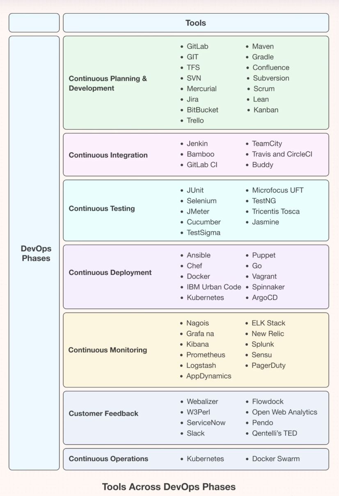
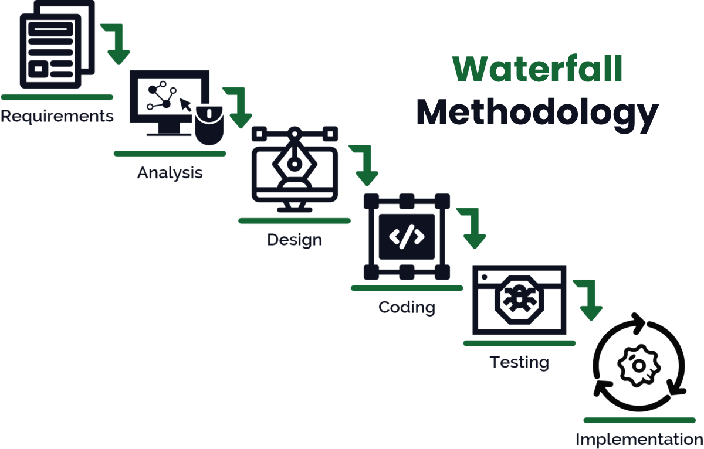
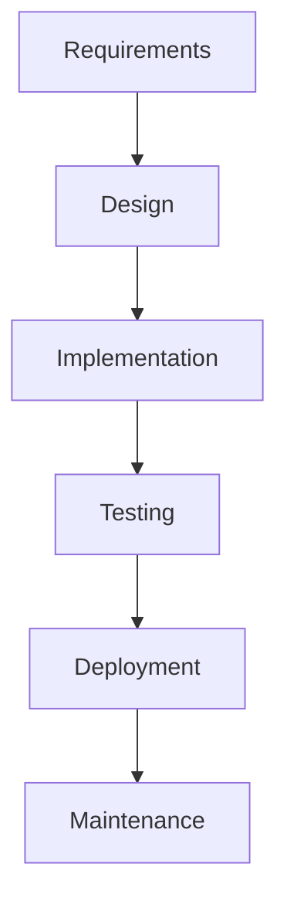
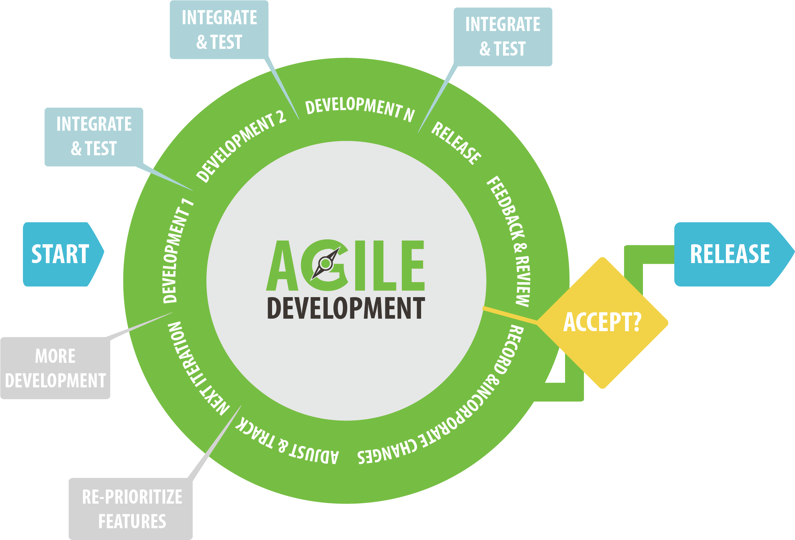
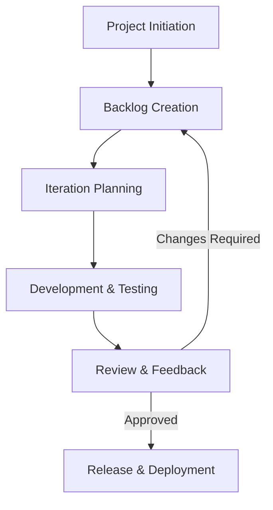

# DevOps and Software Industry Overview

## DevOps Overview

### What is DevOps
- **Definition**: A combination of cultural philosophies, practices, and tools that increases an organization’s ability to deliver applications and services at high velocity.
- **Principles**: Collaboration, automation, continuous integration/continuous delivery (CI/CD), and feedback loops.
- **Culture**: Encourages shared responsibility, transparency, and iterative improvement.

### Benefits of DevOps
- Faster delivery of software and updates.
- Improved collaboration between development and operations teams.
- Scalability and reliability in software systems.
- Enhanced monitoring and feedback mechanisms.

### DevOps Lifecycle
1. **Plan**: Define requirements and goals.
2. **Develop**: Code the application or features.
3. **Build**: Compile and package code into artifacts.
4. **Test**: Validate code functionality and performance.
5. **Release**: Prepare software for deployment.
6. **Deploy**: Launch the application into production.
7. **Operate**: Maintain and monitor the application.
8. **Monitor**: Analyze performance and gather feedback.

### Key Tools in DevOps
- **Source Code Management**: Git.
- **CI/CD**: Jenkins, GitHub Actions.
- **Containers**: Docker.
- **Orchestration**: Kubernetes.
- **Configuration Management**: Ansible, Terraform.
- **Cloud Providers**: AWS, Azure, GCP.

## Introduction to the Software Industry
- **Definition**: The software industry encompasses businesses involved in the development, maintenance, and publication of software.
- **Scope**: Includes system software, application software, and development tools.
- **Growth**: Fueled by technological advancements and increased digital transformation.

## Types of IT Companies
1. **Service-Based Companies**:
   - Provide IT services and solutions to clients.
   - Examples: TCS, Infosys.
2. **Product-Based Companies**:
   - Develop and sell proprietary software products.
   - Examples: Microsoft, Adobe.
3. **Startups**:
   - Focus on innovation and niche solutions.
   - Examples: Zomato, Swiggy.
4. **Consulting Firms**:
   - Offer IT consulting and strategy.
   - Examples: Accenture, Deloitte.

# Software Development Life Cycle (SDLC): Waterfall vs Agile Model

# Waterfall Methodology

## Overview
The **Waterfall Model** is a sequential software development methodology where progress flows in one direction—like a waterfall—through defined phases. Each phase must be completed before moving to the next, ensuring a structured approach to software development.

---

## Phases of the Waterfall Model

### 1️⃣ Requirements Gathering & Analysis
- Understand and document user requirements.
- Outputs: Software Requirement Specification (SRS) document.

### 2️⃣ System Design
- Define the overall system architecture.
- Outputs: High-Level Design (HLD), Low-Level Design (LLD).

### 3️⃣ Implementation (Coding)
- Convert design documents into actual code.
- Outputs: Developed software modules.

### 4️⃣ Testing
- Identify and fix bugs.
- Outputs: Test Cases, Test Reports.

### 5️⃣ Deployment
- Deploy the software in the live environment.
- Outputs: Release notes, Deployment reports.

### 6️⃣ Maintenance
- Fix issues and provide updates.
- Outputs: Bug fixes, Feature updates.

---

## Waterfall Model Diagram

---

## Advantages ✅
- Simple and easy to understand.
- Clear documentation and well-defined phases.
- Best for projects with clear, stable requirements.

## Disadvantages ❌
- Rigid, does not accommodate changes easily.
- Late testing phase may lead to expensive bug fixes.
- Not suitable for complex, evolving projects.

---

## When to Use Waterfall Model?
- When project requirements are **well-defined**.
- When changes are **unlikely** during development.
- For **small to medium-sized** projects.

---

## Comparison with Agile 📊
| Feature         | Waterfall Model | Agile Model |
|---------------|---------------|------------|
| Flexibility    | Rigid         | Highly flexible |
| Feedback       | Late-stage    | Continuous |
| Testing        | After development | Throughout |
| Project Size   | Small/Medium  | Any size |
| Cost of Change | High          | Low |

---

## Conclusion 🎯
The Waterfall Model is a structured, phase-driven methodology best suited for projects with **fixed requirements** and **predictable outcomes**. However, for projects requiring **flexibility and iterative feedback**, Agile or hybrid models may be more effective.

---

## References 📚
- [Waterfall Model on Wikipedia](https://en.wikipedia.org/wiki/Waterfall_model)
- [Agile vs. Waterfall](https://www.atlassian.com/agile/project-management/waterfall-vs-agile)

### Agile Model
- Iterative and incremental.
- Focus on collaboration and customer feedback.
- Pros: Flexibility, faster delivery, better quality.
- Cons: Requires close collaboration, may lack documentation.

# Agile Methodology

## 📌 Introduction
Agile methodology is a project management and product development approach that emphasizes iterative progress, collaboration, and adaptability. Unlike traditional waterfall models, Agile promotes flexibility and continuous feedback.

---

## 🛠️ Key Principles of Agile

Agile is based on the **Agile Manifesto**, which prioritizes:
1. **Individuals and interactions** over processes and tools
2. **Working software** over comprehensive documentation
3. **Customer collaboration** over contract negotiation
4. **Responding to change** over following a plan

### 🔄 Agile Values
- Customer satisfaction through early and continuous delivery
- Welcoming changing requirements at any stage
- Frequent delivery of working software
- Close collaboration between business stakeholders and developers
- Self-organizing teams
- Continuous attention to technical excellence and good design
- Simplicity and efficiency in development

---

## 🏗️ Agile Frameworks
Several frameworks follow Agile principles. Here are the most common ones:

### 1️⃣ Scrum
Scrum is a lightweight framework with short development cycles known as **sprints**.
#### Key Components:
- **Scrum Team**: Product Owner, Scrum Master, Development Team
- **Artifacts**: Product Backlog, Sprint Backlog, Increment
- **Events**: Sprint Planning, Daily Standups, Sprint Review, Sprint Retrospective

### 2️⃣ Kanban
A visual workflow management system that focuses on continuous delivery.
#### Key Concepts:
- **Work in Progress (WIP) limits** to prevent overload
- **Pull system** where new tasks are started only when capacity allows
- **Kanban Board** for tracking progress

### 3️⃣ SAFe (Scaled Agile Framework)
SAFe helps large enterprises implement Agile across multiple teams.
#### Key Features:
- Aligns business strategy with Agile execution
- Uses Agile Release Trains (ARTs) to synchronize work
- Supports Lean and DevOps principles

### 4️⃣ Extreme Programming (XP)
XP is focused on engineering practices to improve software quality.
#### Best Practices:
- Test-Driven Development (TDD)
- Continuous Integration
- Pair Programming
- Refactoring

---

## 🔁 Agile vs. Waterfall Methodology
| Feature        | Agile                          | Waterfall                      |
|---------------|--------------------------------|--------------------------------|
| Flexibility   | High, adaptive to changes     | Rigid, sequential development  |
| Approach      | Iterative and incremental     | Linear, phase-by-phase         |
| Delivery      | Continuous, in small releases | Single final delivery          |
| Collaboration | High involvement of customers | Limited customer involvement   |
| Risk Handling | Low, due to ongoing feedback  | High, as testing happens late  |

---

## 📊 Agile Process Flow (Diagram)

---

## 🎯 Agile Best Practices
- **Daily Stand-ups** to track progress and resolve issues quickly
- **Continuous Integration/Continuous Deployment (CI/CD)** for faster releases
- **User Stories & Story Points** to prioritize work effectively
- **Retrospectives** to continuously improve team processes
- **Automation** to reduce manual efforts and improve efficiency

---

## 📝 Practical Hands-On Exercise

### Task 1: Create a Kanban Board
1. Use Trello/JIRA to create a **Kanban board**.
2. Add columns: **To-Do, In Progress, Done**.
3. Assign team members and track progress.

### Task 2: Conduct a Scrum Sprint Simulation
1. Choose a small project.
2. Define a **Product Backlog** with at least 5 user stories.
3. Run a **2-week sprint** and track progress using daily stand-ups.

---

## 🎓 Summary
Agile methodology helps teams deliver high-quality software efficiently by promoting collaboration, adaptability, and continuous improvement. Popular frameworks like **Scrum, Kanban, and SAFe** provide structured ways to implement Agile in various environments.

🚀 **Adopting Agile leads to faster development cycles, better stakeholder engagement, and improved project success rates!**

---

## 🔗 Additional Resources
- [Agile Manifesto](https://agilemanifesto.org/)
- [Scrum Guide](https://scrumguides.org/)
- [Kanban Introduction](https://www.atlassian.com/agile/kanban)
- [SAFe Framework](https://www.scaledagileframework.com/)

---

📌 **Contributed by:** *Your Name/Organization*

## Real-Life Day-to-Day API Examples
1. Booking a cab on Uber or Ola.
2. Payment processing via PayPal or Razorpay.
3. Fetching weather updates from a weather app.
4. Using maps for navigation (Google Maps).

## Frontend vs Backend: Understanding the Difference
- **Frontend**:
  - Visible part of an application.
  - Technologies: HTML, CSS, JavaScript.
  - Frameworks: React, Angular, Vue.js.
- **Backend**:
  - Server-side logic and database management.
  - Technologies: Node.js, Python, Java.
  - Frameworks: Django, Spring, Express.js.

## Stages of Application Development

### Roles of Developer
- Write and debug code.
- Implement features as per requirements.

### Roles of Tester
- Test the application for bugs and performance issues.
- Ensure the application meets user expectations.

### Roles of Database Team
- Design and manage databases.
- Ensure data security and availability.

### Roles of DevOps Team
- Automate CI/CD pipelines.
- Manage infrastructure and deployment.
- Monitor and optimize application performance.